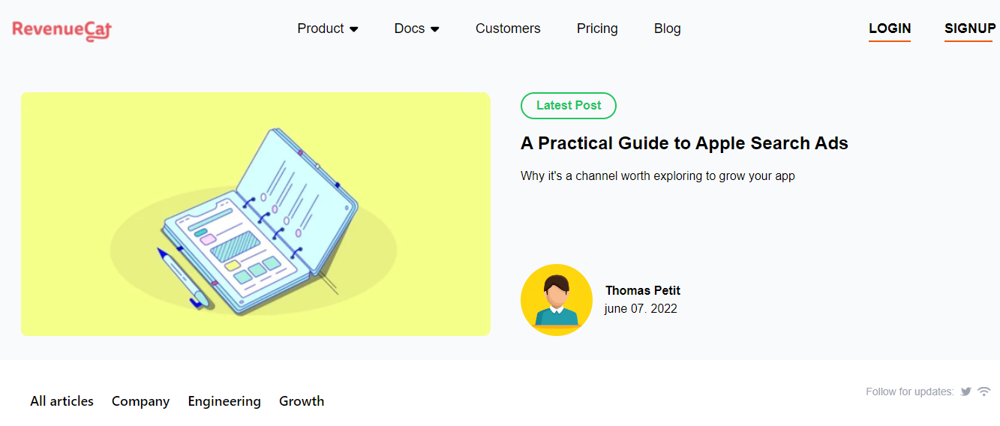

# Welcome to my RevenueCat

- It's a front-end project. I have used Tailwind CSS for giving style and making it responsive.

## Project

- It's a frontEnd made with React.

# React + Vite

- [@vitejs/plugin-react](https://github.com/vitejs/vite-plugin-react/blob/main/packages/plugin-react/README.md) uses [Babel](https://babeljs.io/) for Fast Refresh
- [@vitejs/plugin-react-swc](https://github.com/vitejs/vite-plugin-react-swc) uses [SWC](https://swc.rs/) for Fast Refresh
